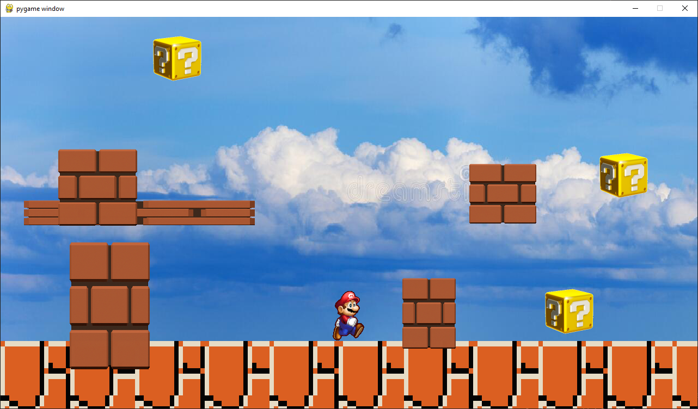

# mvc-mario
This was a school project where I had to make a mario like game with a model view controller architecture.

The java version has the full functionality of the game. The javascript and python versions do not have the saving functionality, and the loading functionality is not fully implemented.

Python Dependencies:
- pygame

<h2>Controls:</h2>

right arrow: move right 
left arrow: move left 
space: jump 
s: save the map 
l: load the map 
e: toggle edit mode
